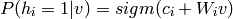

受限波尔兹曼机（Restricted Boltzmann Machines）
==============================================

在这一章节，我们假设读者已经阅读了[使用逻辑回归进行MNIST分类](https://github.com/Syndrome777/DeepLearningTutorial/blob/master/2_Classifying_MNIST_using_LR_逻辑回归进行MNIST分类.md)和[多层感知机](https://github.com/Syndrome777/DeepLearningTutorial/blob/master/3_Multilayer_Perceptron_多层感知机.md)。当然，假如你要使用GPU来运行代码，你还需要阅读[GPU](http://deeplearning.net/software/theano/tutorial/using_gpu.html)。

本节的所有代码都可以在[这里](http://deeplearning.net/tutorial/code/rbm.py)下载。

###基于能量模型（Energy-Based Models）
基于能量的模型（EBM）把我们所关心变量的各种组合和一个标量能量联系在一起。训练模型的过程就是不断改变标量能量的过程，使其能量函数的形状满足期望的形状。比如，如果一个变量组合被认为是合理的，它同时也具有较小的能量。基于能量的概率模型通过能量函数来定义概率分布：


其中归一化因子Z被称为分割函数：


基于能量的模型可以利用使用梯度下降或随机梯度下降的方法来学习，具体而言，就是以先验（训练集）的负对数似然函数作为损失函数，就像在逻辑回归中我们定义的那样，


其中随机梯度为，其中theta为模型的参数。

####包含隐藏单元的EBMs

在很多情况下，我们无法观察到x样本的全部分布，或者我们需要引进一些没有观察到的变量，以增加模型的表达能力。因而我们考虑将模型分为2部分，一个可见部分（x的观察分布）和一个隐藏部分h，这样得到的就是包含隐含变量的EBM：


同时我们受物理启发定义了自由能量（free energy）：


然后我们可以写成如下公式：


数据的服对数似然函数梯度就有如下有趣的形式：


推倒公式如下：


需要注意的是上述的梯度包含2个项，包括正相位和负相位。正和负的术语不指公式中的每个项的符号，而是反映其对模型所定义的概率密度的影响。第一项增加训练数据的概率（通过减少相关的自由能量），而第二项减小模型产生的样本的概率。

通常我们很难精确计算这个梯度，因为式中第一项涉及到可见单元与隐含单元的联合分布，由于归一化因子Z(θ)的存在，该分布很难获取。 我们只能通过一些采样方法（如Gibbs采样）获取其近似值，其具体方法将在后文中详述。


###受限波尔兹曼机（RBM）

波尔兹曼机是对数线性马尔可夫随机场（MRF）的一种特殊形式，例如这个能量函数在它的自由参数下是线性的。为了使得它们能更强力的表达复杂分布（从受限的参数设定到一个非参数设定），我们认为一些变量是不可见的（被称为隐藏）。通过拥有更多隐藏变量（也称之为隐藏单元），我们可以增加波尔兹曼机的模型容量。受限波尔兹曼机限制波尔兹曼机可视层和隐藏层的层内连接。RBM模型可以由下图描述：


RBM的能量函数可以被定义如下：


其中’表示转置，b,c,W为模型的参数，b,c分别为可见层和隐含层的偏置，W为可见层与隐含层的链接权重。

自由能量为如下形式：


由于RBM的特殊结构，可视层和隐藏层层间单元是相互独立的。利用这个特性，我们定义如下：


####二进制单元的RBMs
在使用二进制单元（v和h都属于{0,1}）的普通研究情况时，概率版的普通神经激活函数表示如下：


二进制单元RBMs的自由能力为：




####二进制单元的更新公式

我们可以获得如下的一个二进制单元RBM的对数似然梯度：


这个公式的更多细节推倒，读者可以阅读[这一页](http://www.iro.umontreal.ca/~lisa/twiki/bin/view.cgi/Public/DBNEquations)，或者[Learning Deep Architectures for AI](http://www.iro.umontreal.ca/%7Elisa/publications2/index.php/publications/show/239)的第五节。在这里，我们将不使用这些等式，而是通过Theano的`T.grad`来获取梯度。

###在RBM中进行采样

p(x)的样本可以通过运行马尔可夫链的汇聚、Gibbs采样的过渡来得到。

由N个随机变量（S=(S1,S2,...Sn)）的联合分布的Gibbs采样，可以通过N个采样子步骤来实现,形式如Si～p(Si|S-i)，其中S-i表示集合S中除Si的N-1个随机变量。

我们可以从X的一个任意状态(比如[x1(0),x2(0),…,xK(0)])开始，利用上述条件 分布，迭代的对其分量依次采样，随着采样次数的增加，随机变量[x1(n),x2(n),…,xK(n)]的概率分布将以n的几何级数的速度收敛于X的联合 概率分布P(X)。也就是说，我们可以在未知联合概率分布的条件下对其进行采样。

对于RBMs来说，S包含了可视和隐藏单元的集合。然而，由于它们的条件独立性，可以执行块Gibbs抽样。在这个设定中，可视单元被采样，同时给出隐藏单元的固定值，同样的，隐藏单元也是如此：


这里，h(n)表示马尔可夫链中第n布的隐藏单元的集合。这意味着，h(n+1)根据概率`simg(W‘v(n)+ci)`来随机地被选为0/1。类似地v(n+1)也是如此。这个过程可以通过下面地图来展现：


当t趋向于无穷时，(v(t),h(t))将越加逼近正确样本的概率分布p(v,h)。

在这个理论里面，每个参数在学习进程中的更新都需要运行这样几个链来趋近。毫无疑问这将耗费很大的计算量。一些新的算法已经被提出来，以有效的学习p(v,h)中的样本情况。


###对比散度算法（CD-k）

对比散度算法，是一种成功的用于求解对数似然函数关于未知参数梯度的近似的方法。它使用两个技巧来技术采样过程：
* 因为我们希望p(v)=p_train(v)（数据的真实、底层分布），所以我们使用一个训练样本来初始化马尔可夫链（例如，从一个被预计接近于p的分布，所以这个链已经开始去收敛这个最终的分布p）。
* 对比梯度不需要等待链的收敛。样本在k步Gibbs采样后就可以获得。在实际中，k=1时就可以获得惊人的好的效果。


####持续的对比散度

持续的对比散度[Tieleman08](http://deeplearning.net/tutorial/references.html#tieleman08)使用了另外一种近似方法来从p(v,h)中采样。它建立在一个拥有持续状态的单马尔可夫链上（例如，不是对每个可视样例都重启链）。对每一次参数更新，我们通过简单的运行这个链k步来获得新的样本。然后保存链的状态以便后续的更新。

一般直觉的是，如果参数的更新是足够小相比链的混合率，那么马尔科夫链应该能够“赶上”模型的变化。

###实现


我们构建一个RBM类。这个网络的参数既可以通过构造函数初始化，也可以作为参数进行传入。当RBM被用于构建一个深度网络时，这个选项——权重矩阵和隐藏层偏置与一个MLP网络的相应的S形层共享，就是非常有用的。

```Python
class RBM(object):
    """Restricted Boltzmann Machine (RBM)  """
    def __init__(
        self,
        input=None,
        n_visible=784,
        n_hidden=500,
        W=None,
        hbias=None,
        vbias=None,
        numpy_rng=None,
        theano_rng=None
    ):
        """
        RBM constructor. Defines the parameters of the model along with
        basic operations for inferring hidden from visible (and vice-versa),
        as well as for performing CD updates.

        :param input: None for standalone RBMs or symbolic variable if RBM is
        part of a larger graph.

        :param n_visible: number of visible units

        :param n_hidden: number of hidden units

        :param W: None for standalone RBMs or symbolic variable pointing to a
        shared weight matrix in case RBM is part of a DBN network; in a DBN,
        the weights are shared between RBMs and layers of a MLP

        :param hbias: None for standalone RBMs or symbolic variable pointing
        to a shared hidden units bias vector in case RBM is part of a
        different network

        :param vbias: None for standalone RBMs or a symbolic variable
        pointing to a shared visible units bias
        """

        self.n_visible = n_visible
        self.n_hidden = n_hidden

        if numpy_rng is None:
            # create a number generator
            numpy_rng = numpy.random.RandomState(1234)

        if theano_rng is None:
            theano_rng = RandomStreams(numpy_rng.randint(2 ** 30))

        if W is None:
            # W is initialized with `initial_W` which is uniformely
            # sampled from -4*sqrt(6./(n_visible+n_hidden)) and
            # 4*sqrt(6./(n_hidden+n_visible)) the output of uniform if
            # converted using asarray to dtype theano.config.floatX so
            # that the code is runable on GPU
            initial_W = numpy.asarray(
                numpy_rng.uniform(
                    low=-4 * numpy.sqrt(6. / (n_hidden + n_visible)),
                    high=4 * numpy.sqrt(6. / (n_hidden + n_visible)),
                    size=(n_visible, n_hidden)
                ),
                dtype=theano.config.floatX
            )
            # theano shared variables for weights and biases
            W = theano.shared(value=initial_W, name='W', borrow=True)

        if hbias is None:
            # create shared variable for hidden units bias
            hbias = theano.shared(
                value=numpy.zeros(
                    n_hidden,
                    dtype=theano.config.floatX
                ),
                name='hbias',
                borrow=True
            )

        if vbias is None:
            # create shared variable for visible units bias
            vbias = theano.shared(
                value=numpy.zeros(
                    n_visible,
                    dtype=theano.config.floatX
                ),
                name='vbias',
                borrow=True
            )

        # initialize input layer for standalone RBM or layer0 of DBN
        self.input = input
        if not input:
            self.input = T.matrix('input')

        self.W = W
        self.hbias = hbias
        self.vbias = vbias
        self.theano_rng = theano_rng
        # **** WARNING: It is not a good idea to put things in this list
        # other than shared variables created in this function.
        self.params = [self.W, self.hbias, self.vbias]
```
下一步就是去定义函数来构建S图。代码如下：

```Python
    def propup(self, vis):
        '''This function propagates the visible units activation upwards to
        the hidden units

        Note that we return also the pre-sigmoid activation of the
        layer. As it will turn out later, due to how Theano deals with
        optimizations, this symbolic variable will be needed to write
        down a more stable computational graph (see details in the
        reconstruction cost function)

        '''
        pre_sigmoid_activation = T.dot(vis, self.W) + self.hbias
        return [pre_sigmoid_activation, T.nnet.sigmoid(pre_sigmoid_activation)]
```

```Python
    def sample_h_given_v(self, v0_sample):
        ''' This function infers state of hidden units given visible units '''
        # compute the activation of the hidden units given a sample of
        # the visibles
        pre_sigmoid_h1, h1_mean = self.propup(v0_sample)
        # get a sample of the hiddens given their activation
        # Note that theano_rng.binomial returns a symbolic sample of dtype
        # int64 by default. If we want to keep our computations in floatX
        # for the GPU we need to specify to return the dtype floatX
        h1_sample = self.theano_rng.binomial(size=h1_mean.shape,
                                             n=1, p=h1_mean,
                                             dtype=theano.config.floatX)
        return [pre_sigmoid_h1, h1_mean, h1_sample]
```

```Python
    def propdown(self, hid):
        '''This function propagates the hidden units activation downwards to
        the visible units

        Note that we return also the pre_sigmoid_activation of the
        layer. As it will turn out later, due to how Theano deals with
        optimizations, this symbolic variable will be needed to write
        down a more stable computational graph (see details in the
        reconstruction cost function)

        '''
        pre_sigmoid_activation = T.dot(hid, self.W.T) + self.vbias
        return [pre_sigmoid_activation, T.nnet.sigmoid(pre_sigmoid_activation)]
```

```Python
    def sample_v_given_h(self, h0_sample):
        ''' This function infers state of visible units given hidden units '''
        # compute the activation of the visible given the hidden sample
        pre_sigmoid_v1, v1_mean = self.propdown(h0_sample)
        # get a sample of the visible given their activation
        # Note that theano_rng.binomial returns a symbolic sample of dtype
        # int64 by default. If we want to keep our computations in floatX
        # for the GPU we need to specify to return the dtype floatX
        v1_sample = self.theano_rng.binomial(size=v1_mean.shape,
                                             n=1, p=v1_mean,
                                             dtype=theano.config.floatX)
        return [pre_sigmoid_v1, v1_mean, v1_sample]
```


